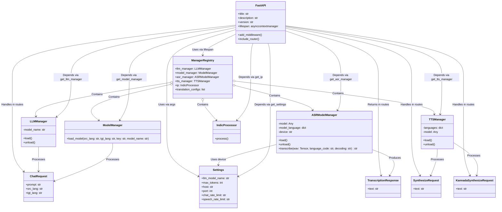

# Dhwani Server

Dhwani API is a FastAPI-based application providing AI-powered services for Indian languages, including text-to-speech (TTS), language model (LLM) chat, vision-language model (VLM) capabilities, and automatic speech recognition (ASR). It supports lazy loading of models for fast startup and includes endpoints for various tasks.

## Features
- **Text-to-Speech (TTS)**: Generate audio from text in Indian languages using Parler TTS.
- **Chat**: Process Kannada prompts and respond in Kannada via translation and LLM.
- **Vision-Language Model (VLM)**: Caption images, answer visual queries, detect, and point objects.
- **Automatic Speech Recognition (ASR)**: Transcribe audio files in multiple Indian languages.
- **Lazy Loading**: Models load on-demand or via an explicit endpoint for fast startup.

## Prerequisites
- **System Requirements - User **:
    - **Python**: 3.10
    - Ubuntu 22.04
    - git 
    - vscode
- **System Requirements - Server **:
  - Ubuntu with sufficient RAM (16GB+ recommended for models).
  - Optional: NVIDIA GPU with CUDA support for faster inference.
- **FFmpeg**: Required for audio processing (ASR).

- Server Setup
```bash
wget https://github.com/slabstech/dhwani-server/blob/4445b380fc07d2e552cd98776465ee751b7e9997/install_script.sh
chmod +x install_script.sh
bash install_script.sh

export HF_HOME=/home/ubuntu/data-dhwani-models
export HF_TOKEN='YOur-HF-token'
python src/server/main.py --host 0.0.0.0 --port 7860 --config config_two
```
## Installation

1. **Clone the Repository**:
   ```bash
   git clone https://github.com/slabstech/dhwani-server
   cd dhwani-server
   ```

2. Install Libraries:
    - On Ubuntu: ```sudo apt-get install ffmpeg build-essential```

3. Set Up Virtual Environment:
    ```bash
    python -m venv venv
    source venv/bin/activate 
    ```
4. Install Dependencies:
    ```bash
    sudo apt-get install -y ffmpeg build-essential
    curl --proto '=https' --tlsv1.2 -sSf https://sh.rustup.rs | sh -s -- -y --no-modify-path --profile minimal
    . "$HOME/.cargo/env"
    export CC=/usr/bin/gcc
    export ENV CXX=/usr/bin/g++
    ```
    ```bash
    pip install --no-cache-dir --upgrade pip setuptools psutil setuptools-rust torch==2.6.0
    pip install --no-cache-dir flash-attn --no-build-isolation
    ```

    ```bash
    pip install -r requirements.txt
    ```
    
4. Set Environment Variable:
    Create a .env file in the root directory and add your API key:
    plaintext
    ```bash
    API_KEY=your_secret_key
    ```

5. Running the Server
    - Start the Server:
    ```bash
    python src/server/main.py --port 7860 --host 0.0.0.0
    ```

    - The server starts quickly with lazy-loaded models.
    - Access the interactive API docs at http://localhost:7860/docs.
    
    - (Optional) Load All Models:
    Preload all models (LLM, Translation, TTS, VLM, ASR) with:
    - 
    ```bash
    curl -X POST "http://localhost:7860/load_all_models" -H "X-API-Key: your_secret_key"
    ```

- Usage
    - Endpoints
        - All endpoints require the X-API-Key header with the value from your .env file.

    -    Health Check: GET /health
    ```bash
        curl "http://localhost:7860/health"
    ```
    - Response: 
        ```bash 
        {"status": "healthy", "model": "Qwen/Qwen2.5-3B-Instruct"}
        ```
    
    - Text-to-Speech: POST /v1/audio/speech
    ```  bash
    curl -X POST "http://localhost:7860/v1/audio/speech" -H "X-API-Key: your_secret_key" -H "Content-Type: application/json" -d '{"input": "ನಮಸ್ಕಾರ", "voice": "Female voice", "model": "ai4bharat/indic-parler-tts", "response_format": "mp3"}' --output speech.mp3
    ```
    - Chat: POST /chat
    ``` bash
        curl -X POST "http://localhost:7860/chat" -H "X-API-Key: your_secret_key" -H "Content-Type: application/json" -d '{"prompt": "ನೀವು ಹೇಗಿದ್ದೀರಿ?"}'
    ```

    - Response: 
            ```{"response": "<Kannada response>"}```
    - Image Captioning: POST /caption/
    ```bash
        curl -X POST "http://localhost:7860/caption/" -H "X-API-Key: your_secret_key" -F "file=@image.jpg" -F "length=short"
    ```
    - Response:``` {"caption": "<short caption>"}```
    - Visual Query: POST /visual_query/
    ```bash
        curl -X POST "http://localhost:7860/visual_query/" -H "X-API-Key: your_secret_key" -F "file=@image.jpg" -F "query=What is this?"
    ```
    - Response: ```{"answer": "<answer>"}```
    - Object Detection: POST /detect/
    ```bash
        curl -X POST "http://localhost:7860/detect/" -H "X-API-Key: your_secret_key" -F "file=@image.jpg" -F "object_type=face"
    ```
    - Response: ```{"objects": [<list of detected objects>]}```
    - Object Pointing: POST /point/
    ```bash

        curl -X POST "http://localhost:7860/point/" -H "X-API-Key: your_secret_key" -F "file=@image.jpg" -F "object_type=person"
    ```
    - Response: ```{"points": [<list of points>]}```
    - Transcription: POST /transcribe/
    ```bash
    curl -X POST "http://localhost:7860/transcribe/?language=kannada" -H "X-API-Key: your_secret_key" -F "file=@audio.wav"
    ```
    - Response: ```{"text": "<transcribed text>"}```
    - Batch Transcription: POST /transcribe_batch/
    ```bash
    curl -X POST "http://localhost:7860/transcribe_batch/?language=kannada" -H "X-API-Key: your_secret_key" -F "files=@audio1.wav" -F "files=@audio2.mp3"
    ```
    - Response: ```{"transcriptions": ["<text1>", "<text2>"]}```

- Notes
    - Lazy Loading: Models load on first use or via /load_all_models. Expect a delay on the first request for each model type.
    Supported Languages: ASR supports multiple Indian languages (e.g., kannada, hindi, tamil); see models/asr.py for the full list.
    Logs: Check dhwani_api.log for detailed logs (rotated at 10MB, 5 backups).
    Performance: Use a GPU with flash-attn installed for faster TTS and ASR inference.

- Troubleshooting

    - Module Errors: Ensure all dependencies are installed. Re-run pip install if needed.
    FFmpeg Not Found: Install FFmpeg and ensure it’s in your PATH.
    Permission Denied: Run with sudo if accessing restricted ports (e.g., < 1024).


-- 
### Projet Structure





---

find . -name "*.pyc" -delete
find . -name "__pycache__" -type d -exec rm -rf {} +